

<h1 align="center">SeedSigner Independent Custody Guide</h1>

(<b>Some Notes on Titling:</b> I almost chose "The SeedSigner Manifesto" as a grab-your-attention title with a little bit of cheekiness baked in. As I think more and more about Bitcoin custody and how it has evolved over time, the term "manifesto" seems increasingly appropriate to use for some of the ideas that underlie this guide. Manifestos commonly challenge conventional ways of thinking about things and can be threatening to status quo beliefs.

As I view the longer arc of Bitcoin custody, I think of it in three epochs. The first is the epoch characterized by Bitcoin Core and paper wallets, Core being of course the earliest way to store bitcoin, and paper wallets being representative of early attempts at facilitating that storage with improved security assurances.

I consider the second epoch to be the hardware wallet era; that is, the era of proprietary, USB-connected, secure element equipped, separate hardware devices that represented a big advance in bitcoin custodial security assurances, but with some significant compromises, some of which involve varying degrees of reliance on third parties. The second epoch was facilitated by the hierarchical deterministic wallet and the BIP39 seed phrase standards.

In my view, the third custody epoch is being ushered in by the PSBT (partially signed bitcoin transaction) standard, the implementation and refinement of multi-signature wallet standards, and the ongoing re-thinking of how we can increase the separation between devices/software that interact with the Bitcoin protocol, and devices/software that interact with private keys. In my view, stateless signing devices like SeedSigner that leverage transparently airgapped communication (read QR-exchange protocol rather than NFT), with a focus on facilitating user-accessible multi-signature wallet use, will emerge as emblematic of this third epoch of Bitcoin custody. The Do-It-Yourself (DIY) aspect of SeedSigner, leveraging general purpose hardware and FOSS code, will also serve to shift control away from purpose-built, proprietary hardware, moving that power back into the hands of users.

This "manifesto", then seeks to advance the idea that with the right mix of design inputs, users can have acces to simple, user-friendly bitcoin self-custody, with reasonably solid security assurances, using inexpensive, discreetly-acquired hardware, & FOSS code.)

  

  
  
## Introduction

Most Bitcoiners understand the importance of self-custody to the larger Bitcoin ecosystem -- as a digital bearer asset, having personal custody is the whole point (not your keys...not your coins). And holding one's own private keys is not merely some kind of Bitcoiner virtue signaling mechanism, but serves several important functions within the larger Bitcoin ecosystem. Practicing self-custody:

- Protects bitcoin owners from loss of funds due to custodial service thefts or rugpulls
- Allows users to send bitcoin to any recipient without the need for permission **from anyone**
- Is foundational to privacy-conscious Bitcoin usage
- Protects Bitcoin as a financial asset from rehypothication & other forms of value dilution
- Helps Bitcoin users understand the network's technical fundamentals (when done properly)

Understandably, the first reason above is the primary concern of most people wanting to hold their own keys --  where your money goes, your mind follows. But for many of those earnestly wanting to get to the self-custody finish line, things can get in the way, life happens. A lot of it can have to do with uncertainty and analysis-paralysis. What hardware do I need? Which software is the best? Where should I store backups? What security trade-offs make sense for me?

I am assembling this guide as a living document to (hopefully) help people get to that self-custody finish line, using the custody framework that has evolved over time to make the most sense to me. When engineering a self-custody system, there are numerous variables to consider -- I've tried to minimize the decision tree's branches to make the process less overwhelming for people who might be prone to obsessing over the details. I'll also attempt to justify these choices wherever I can. Depending on your situation, it may be appropriate to work through this guide with some kind of self-custody "coach" or consultant, who can provide further context and answer questions along the way. With a few supplemental materials, this document may also sever as a guide for those pursuing a more self-guided custody journey.

I should also note that early on in this guide, it may read more like an essay and less like a technical guide. Though I initially set out to write a more step-oriented document, questions of "why" persistently kept coming up. The plain truth is that much of the time if people don't understand the "why" behind their actions, they're not going to have a high degree of confidence or conviction about what they're doing. And because I believe confidence is a huge part of executing a Bitcoin savings plan, I'm going to allow for a good amount of digression, tangents and detours, so just prepare yourself.

But back to nuts and bolts; at this point it's useful to list some assumptions this guide makes about the intended audience:

### This Guide's Assumptions About Users:
- You are seeking to secure what is, or you expect to become, a significant amount of value
- You are willing to spend a reasonable amount of time & energy to create a self-custody system
- You are willing to spend at least ~$100 on the necessary hardware & supplies
- You have access to at least two remote, secure locations for key storage
- You are comfortable with SeedSigner's overall security model (more on this below)

It also makes sense to list what you'll need early on so you can have a sense of what you're getting into:

### Necessary Items:
- A computer running Sparrow Bitcoin Wallet (https://sparrowwallet.com)
- An assembled SeedSigner Bitcoin signing device (https://seedsigner.com)
- A printer with paper
- Some sort of metal backup solution (optional, but strongly recommended)

## First Off, Why Sparrow?

Sparrow is a software program that runs on each of the Big-3 computer OS platforms (Windows, Mac, Linux) that can be described as a bitcoin "wallet coordinator". What this designation means is that while you can absolutely use it for single-signature wallets, a big part of Sparrow's value proposition is that you can use it to take multiple Bitcoin private keys and "coordinate" them into a multi-signature wallet. Sparrow is designed to be run on a computer with an active intenet connection, and manages your wallet's interaction with the larger Bitcoin protocol.

"Specter Desktop" (https://specter.solutions) is another high-quality software program that can be used to create and manage multi-signature Bitcoin wallets, with functionality similar to Sparrow (side note: Specter also created an an airgapped Bitcoin wallet that was a big part of the inspiration for SeedSigner; more into at https://github.com/cryptoadvance/specter-diy). Specter Desktop generally requires users to have/operate a full Bitcoin node, which could be a standalone, purpose-built computer, or could be an instance of the Bitcoin core software (https://github.com/bitcoin/bitcoin/releases) running on the same system where Specter desktop is installed. Though running a full node is unarguably a more secure, more private way to access the Bitcoin protocol (and something I personally think that most Bitcoiners should do (or aspire to do), I didn't want it to be a deal-breaking requirement for this guide. As it is with privacy, digging into Bitcoin is a process and people should know that it takes time and you don't have to do everything at once. Undertaking self-custody in the proper way is a big enough task in and of itself.

"BlueWallet" (https://bluewallet.io) is another software program that can be used to create and manage multi-signature Bitcoin wallets, but differently from Sparrow and Specture, BlueWallet is primarily intended for use on iOS and Android devices (though there is a Mac version too!). BlueWallet does not require the use of a full node, and being a mobile-based coordinator is what makes it so compelling given that in many parts of the world, mobile devices are the primary way people interact with Bitcoin as well as the broader internet. BlueWallet is a high-quality, feature-ful application for creating and using multi-signature Bitcoin wallets (and Lightning wallets too!) but in my opinion BlueWallet's achilles heel, at least for the purposes of this guide, is that it does not support Bitcoin testnet. More on Testnet to come.

It should be ntoed that the multi-signature custody setup this guide intends to help users create can also absolutely be created and operated with both Specter desktop or BlueWallet, but again with the goal of minimizing the number of branches on the decision tree, I have elected to focus on Sparrow.

## And Why Multi-signature Wallets?

Multi-signature wallets have gotten a bad reputation. Several years ago when the concept started to gain traction in the Bitcoin ecosystem, the hype and value proposition was real but it it took a fair amount of time for proper tools to be developed. Like most tools, the earliest versions necessarily targeted a more-technical audience, and by the time those tools emerged the larger hype around multi-signature wallets had died down, resulting in them being perceived as a more niche self-custody option.

One of the primary goals of this guide is to permanently shatter and discard the notion that multi-signature wallets are too complex for most, if not all, Bitcoiners -- full stop. If a given multi-signature wallet seems too complex and is practically too difficult for most Bitcoiners to use, that is the wallet's fault and it's developers need to proverbially "return to the drawing board".

The most approachable way that I've found for people to think about multi-signature wallets is to think about your Bitcoin storage like a corporate board (sometimes referred to in technical-speak as a "quorum"). Your funds are the board's treasury, and they can only be accessed or moved with the approval of a certain number of board members (sometimes referred to as "co-signers"). Usually the number of signers required to access funds is a majority of the total signers (think 3-of-5) but the chartering documents that are laid out when the board was created (sometimes referred to as the "multisig policy") dictate how many votes are needed to access funds. (A board that only required one member to be able to approve the movement of funds wouldn't make a lot of sense, and in most scenarious a board that required every member to approve transactions similarly doesn't make sense)

Like most analogies, this one breaks down as you get deeper into the technical details, but it still serves as a good starting point for most. But now with a general idea of how multi-signature wallets work, what are the advantages & disadvantages?

### Multi-signature wallet advantages:
- Introduces fault-tolerance to Bitcoin storage (no more single-point-of-failure)
- Facilitates the distibution of custody among multiple, disparate parties
- Allows for physical, geographic distribution of the keys that make up a given wallet
- Allows for the use of muliple different hardware/software security models among cosigners

### Multi-signature wallet disadvantages:
- Increased techncial complexity that could result in loss of funds
- Increased volume of information that needs to be stored/maintained
- Users making multiple mistakes could still result in loss of funds

The first multi-signature storage advantage of fault tolerance is actually multi-faceted. With a single-signature wallet, the go-to strategy to mitigate the risk of **losing** a key is to keep a second copy of the secret that secures your Bitcoin. This second copy of the secret is often kept in a separate location with an emphasis on physical security, as the other copy is often protected by some kind of technological access safeguard (read secure element, PIN, etc.). But the mere existence of this second copy ironically increases the risk of the private key being not lost, but rather disclosed, to a potentially malicious third party (think of a rogue bank employee snooping in safe deposit boxes, or perhaps a more targeted malicious attack on a "remote-but-secure" location). Multisignature wallets allow for a scenario where the loss **or** the disclosure of a secret does not necessarily result in catastrophe.

It is my view that the fault tolerance afforded by a multi-signature storage strategy outweighs the necessary added complexity & information management requirement, especially when attempting to safeguard a substantial amount of value. Others are welcome to have differing opinions and takes on these trade-offs, but if you are convinced of the appropriateness of multi-signature storage for your circumstances, I welcome you to read on.

## What's the story with this SeedSigner thing anyway?

When I initially set out to write this guide, I didn't intend to tell the broader story of how SeedSigner came about, but as I thought more about the device's unique characteristics, the story behind its creation helps provide context for the various design decisions that were made as SeedSigner came into being. So here goes:

As I was trying to improve my Bitcoin storage security posture, I found myself in the camp of believers that the benefits of multi-signature storage outweigh the costs/risks. But I am frugal, or put more bluntly, a cheapskate. The prospect of spending $500 or more on hardware wallets was unappealing to me. This position is actually a mistake because depending on the amount of value you are attempting to secure, it absolutely makes sense spend a reasonable proportion of that value to add safeguards to protect against the value's theft/loss. But my inner-cheapskate was convinced that there should be a way to set up and operate multi-signature storage without the absolute need for several devices.

Enter Specter-DIY, as referenced above. While I'd been researching Specter desktop and other emerging multi-signature storage tools, I came across the Specter-DIY, a DIY (do-it-yourself) Bitcoin wallet made from easily acquireable electronic components. One of the most interesting aspects of the Specter-DIY for me was it's use of animated QR code sets to communicate proposed transaction information from the multi-signature wallet coordinator software (in this case Specter Desktop) to the Specter-DIY, where the wallet's private key was available. An updated proposed transaction was then passed back to the multi-signature coordinator software from the Specter-DIY (more on this mechanism, which in technical jargon is referred to as a "partially signed Bitcoin transaction", to come), again using QR codes.

This procedure made so much sense to me given my background in digital forensics (with a little bit of information security training sprinkled in). How the private key (which is the absolute safeguard of any Bitcoin storage scheme) could be stored and used on a device separate from the multi-signature coordinator, with only a very narrow QR-exchange communication protocol used to facilitate communication between them (instead of a USB connection), was such an elegant and relatively simple solution. In the digital forensics realm, great care and attention is given to when and how evidentiary devices are permitted to connect to evidence-collection devices; this great care arises from the broader criminal forensic discipline's reliance on Locard's "exchange principle". The exchange principle dictates that when there is physical contact between two given items, there will be an exchange of microscopic material between them. Loosely applied to the discipline of digital forensics, when you connect two electronic devices, "things can happen" that can involve either the transfer of data, or even the creation of new data as a result of the connection. Digital forensic practitioners seek to avoid such, or at least be able to document and explain it, wherever possible.

My interest in Specter-DIY led me to begin casually interacting with members of the Specter team, as well as security researcher Michael Flaxman, author of the excellent "10x Bitcoin Security Guide" (https://btcguide.github.io/). Having previously tinkered with 3D printing and computer-aided design, I created designs for 3D-printable enclosures the DIY. While interacting with Flaxman, he shared an idea for a simple device that integrated a Raspberry Pi Zero single board computer with a display-plus-controls module that would allow users to input seed words they had randomly selected from the BIP39 list and use the device to calculate a seed phrase's final word, that acts as a kind of checksum against the words that precede it. (This mechanism is intended to alert users to errors they might make when entering a seed phrase into a given device.) The beauty part of Flaxman's idea was that the proposed device used a specific version of the Raspberry Pi Zero, the version 1.3 that did not include the physical hardware necessary for th Pi to connect to other devices via WiFi or Bluetooth).

When conducting a digital forensic exam on a mobile electronic device, the practice of radio isolation (using "Faraday" cages a la Michael Faraday) is often implemented to prevent devices subject to examination from connecting to wireless networks (via WiFi or cellular connection) or other device's (via Bluetooth). This isolation prevents incoming data from causing changes on the device (the worst of which being a "death from above" remote wipe signal) and allows for a more controlled examination/acquisition of a mobile electronic device, with a more static data set. I should also note that for security reasons, the digital forensic lab in which I work utilized an internal, offline network that was not architected to connect to the internet. Forensic evidentiary data could be shared by machines in different parts of the lab, but data travel beyond the lab's internal network was not possible. There were several reasons for this segregation, but it basically boiled down to not wanting any of our private data to be able to get out, nor wanting any undesirable data from the open internet to be able to get in.

Flaxman's idea of using a computer with no means of wireless communication to calculate final seed words enforced the same kind of network isolation we had used in the forensic lab and ensured that the private data comprised by the seed phrase would remain private, in a kind of "can't be evil" way. I ordered the necessary components and set to work translating my rudimentary coding skills into a proof-of-concept. Without too much trouble I cobbled together a device that would allow a user to enter 23 BIP39 seed words, and use a Python Bitcoin library called Embit (h/t to Stepan Snigerev of Specter) to generate an appropriate checksum word for a proper seed.

After coding a rudimentary dice-to-seed module that would convert 99 dice rolls into a 24-word seed phrase, I started to look for more use cases for my new "toy". I realized that with the addition of an inexpensive, Raspberry Pi-compatible camera, I might be able to replicate the core air-gapped transaction signing ability of the Specter-DIY.

With some more stackoverflow-intensive research and coding, I was able to replicate the DIY's QR-exchange transaction-signing process, and at this point the full concept of SeedSigner had been born. An issue still remained however relative to private keys: would you really want this little device to remember your private keys? Given the absence of any kind of secure enclave technology in the Raspberry Pi platform that would be able to provide users with some assurance their private key was being stored securely, the resounding answer was a "no", you would not want this device storing your private keys.

The solution to this problem was once again found in my experiences in the forensic lab. To acquire data from hard drives in a forensically defensible manner, examiners will commonly use linux-based "live" operating systems. These forensic live-OS tools allow you to power on an evidentiary computer, connect an evidentiary-collection hard drive, and essentially use a “bad guy’s” computer to acquire the data from its internal storage location(s). The defining characteristic of these forensic live operating systems is that they operate entirely in the target computer's memory (and then conduct a read-only acquisition of attached storage media) such that after you power the target system off, no persistent, residual data from the acquisition is left behind (this is because data in computer memory is “volatile”, meaning it dissipates when power is removed from the hardware). If my little handheld signing device was simply not engineered to "remember" private keys (only utilizing the keys as a python variable in memory), the issue of securely storing a key on the signing device could be avoided altogether. And not storing keys meant that the device could in theory be safely used with multiple keys, obviating the need for a dedicated hardware device for each private key within a multi-signature wallet!

The bill-of-materials cost for my physically-disconnected, wireless-incapable, amnesiac device came to approximately $35, a satifying result for my inner cheapskate. But as I shared my idea for a signing device with others Bitcoiners, privacy-related advantages associated with the tool also emerged. Because a SeedSigner is not built from any components that are recognizably identified as bitcoin-specific by most people, they can be acquired without signaling to a merchant or anyone else an intention to build a Bitcoin signing device, or otherwise an intention to interact with the Bitcoin network. For those with strong privacy concerns, this is a desirable feature, and for those living in part of the world where Bitcoin use is discouraged or outright banned (thus making it difficult or impossible to securely and reliably source hardware wallets) SeedSigner can provide a more secure way to secretly save with Bitcoin.

Reading the story behind how SeedSigner came into existence highlights many of the device's advantages, but to condense them more explicitly:

- Operation-in-isolation (no USB/WiFi/Bluetooth) dramatically reduces attack vectors
- Low build cost makes the device accessible to more people in more parts of the world
- Statelessness makes using SeedSigner with multiple seeds and/or multiple wallets feasible
- Underlying fully-FOSS softare architecture makes independent build-yourself-from-source possible
- Use of non-Bitcoin-specific hardware can enhance user privacy

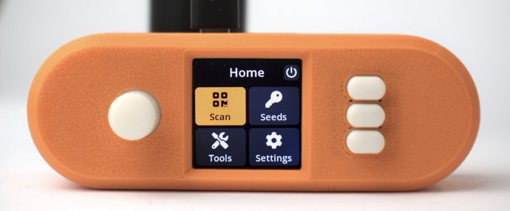

## Alright, But There's Got to Be a Catch, Right?

No technology, especially security-related technologies, are **ALL** positive, there have to be trade-offs or vulnerabilities, right? Absolutely yes. Let me list some of the criticisms/vulnerabilities I am aware of and then I'll discuss them one by one:

- direct access to seeds increases their discloure opportunity
- a full linux installation has a large attack surface
- airgapped communication is security theatre that results in a worse user experience
- unpaid developers don't have time time/expertise/care to properly "do security"
- lack of software validity assurances leaves open the possibility of malicious code installation
- an evil maid could use malicious code to exfiltrate private keys
- the Broadcom BCM2835 chip used in Pi Zero is closed source and potentially compromised

These are the potential weaknesses/vulnerabilities that have been communicated directly to me, or that I have gleaned from observing comments in public forums; if additional criticisms come to light, I will add them to this document.

**Direct access to seeds increases their disclosure opportunity:** This is one that is reasonable and that I agree with. Though some people that appreciate the SeedSigner model have begun using it for their more day-to-day storage needs, the larger model was designed with cold storage in mind, meaning that I anticipate Bitcoin savers using the SeedSigner model would need to make outgoing transactions 1-2 times a year, if that. Deposits to a multi-signature wallet, including to newly-generated receive addresses, can of course be made without accessing private keys. So this means that your seed phrases stay in some kind of remote, physically secure, non-visibly secure, tamper-evident storage spot (more on this later), and when you do access your seed phrases, obvious care should be taken to access them in areas that they will not be seen by unwanted persons, or in areas that are subject to visual surveillance, etc.

**A full linux installation has a large attack surface:** This is another reasonable criticism. Bitcoin hardware security devices written using languages that run on "bare-metal" unarguably have fewer attack vectors or opportunities to introduce code with malicious intent. For SeedSigner, once the operating system image has been written to the MicroSD card that is installed in the signer, I believe that operating the device in isolation from the internet and other devices provides sufficient assurances that malicious code intended to exploit vulnerabilities in the Raspberry Pi OS can't be inadvertently inserted by a SeedSigner user.

**Airgapped communication is security theatre that results in a worse user experience:** I wholeheartedly disagree with the first part of this. Once the MicroSD card is installed in SeedSigner, the only way that the device can communicate with the outside world is via the attached camera, and the display screen. The QR exchange protocol is an effective means of using those two components to facilitate two-way communication with an extremely limited scope. It is technically possible for private key information to be communicated via QR codes displayed on the devices screen, but for an attacker to take advantage of such a situation, both the SeedSigner installation would need to be compromised, and the computer being used with SeedSigner would need to be compromised in some way so as to recognize, capture, and externally communicate the secret. As for the user experience, QR exchange is unarguably less convenient than other methods of communication, but I consider it to be a more than acceptable trade-off given the importance of maintaining the security of private keys.

**Unpaid developers don't have time time/expertise/care to properly "do security":** Many of Bitcoin Core's most sophisticated contributors have made their contributions while not being employed by a company sponsoring their work on the protocol. This kind of blanket statement is sloppy, bordering on malicious, criticism. As a fully FOSS (Free and Open Source Software) project, the SeedSigner code is available to audit and interested parties can suggest additions or modifications as they deem necessary. Security vulnerabilities are further discovered in code written by "professionals" all of the time.

**Lack of software validity assurances leave open the possibility of malicious code installation:** I'd classify this criticism as generally valid but mitigate-able. The meat of this criticism is that because the Pi Zero has no security mechanism to validate installed software as coming from a "trusted source", users might inadvertently download and install a rogue version of the SeedSigner software from a malicious source. Such malicious software could attempt to accumulate a user's private keys, replace addresses in partially signed transactions, as well as other mischevious schemes. Just as self-custody calls upon you to take ultimate responsibility for your Bitcoin stack, you are the SeedSigner software validation mechanism and are responsible for ensuring that authentic software is installed on the device. I have published a PGP public key and sign a message containing a SHA256 hash of each prepared release; steps on how to properly download, verify and write a SeedSigner release image to MicroSD will be subsequently discussed in this document.

**An evil maid could use malicious code to exfiltrate private keys:** The "evil maid" attack typically describes a malevalent third party who has access to a given individual's private space, and happens to inadvertently & secretly come across sensitive or valuable items or information that they steal or otherwise exploit. In the context of SeedSigner, this attack might be renamed the "evil adversary that can create sophisticated malware and secretly accesses your signing device on multiple occasions, installing undetectable rogue software, and subsequently secretly returning to abscond with your private key(s)... attack". I don't want to write this type of attack off as far-fetched, but reasonable countermeasures are to store your SeedSigner in a relatively secure place, use tamper-evident packaging if you feel it to be necessary given your home environment, and if for some specific reason you become concerned that your SeedSigner software may have been tampered with, simply zero out your MicroSD and re-write the software release image to the memory card.

**The Broadcom BCM2835 chip used in Pi Zero is closed source and potentially compromised:** This is perhaps the most vague criticism of SeedSigner I have come across. I haven't located any information to indicate a specific backdoor or other vulnerability relating to the Broadcom chip used on the Raspberry Pi Zero that would create a security vulnerability relating to SeedSigner. Honestly, if the broader Broadcom ecosystem has an undisclosed zero-day vulnerability, the entire Bitcoin network is likely in trouble given the popularity of the standard Raspberry Pi as a full node hardware platform.

## So What Does This SeedSigner Thing Actually Do?

Generally speaking, SeedSigner helps Bitcoiners accomplish three important independent custody tasks:

- Creating secure private keys in a trust-minimized way
- Generating extended public keys used during initial wallet configuration
- Securely signing transactions via animated QR code sets

Each one of these tasks actually deserves some elaboration, so here we go...

### Creating Secure Private Keys in a Trust-Minimized Way

What makes a Bitcoin private key secure? Simply put, ensuring that the private key is generated from information that is un-predictable, un-reproduceable, and un-guessable. These characteristics pretty well nail down what comprises the mathematical concept of entropy, i.e. randomness. Though there have been advances in the ability of software to generate unpredictable data, disagreements persist on the theoretical ability of truly random data to arise from organized, logical code created by human beings. (This may go without saying, but it's not a best practice to trust a private key generated by a bitcoin storage device that does not incorporate any kind of user input into the process.)

It turns out that the simplest, easiest, and perhaps best way to capture entropic data is via the randomness inherent in the movements of the physical world that surrounds us. The best example of this phenomenon I have come across are fingerprints. Human fingerprints, which are created with almost innumerable inputs that include in utero blood pressure, blood oxygen levels, maternal nutrition, hormone levels, amniotic fluid density & composition, fetal position & movement, and even the sum of maternal movement during pregnancy. All of these variables shape the tiny ridges we all have on our finger tips. Given the amount of inputs, it would be virtually impossible to recreate these variables twice, which is why fingerprints are thought to be absolutely unique to a given individual, with no two individuals ever having had identical prints.

Rather than waiting the 9-months it takes to form human fingerpints, Bitcoiners need a more quick-and-dirty way of capturing some physically generated entropy for use in private key generation. With the creation of the BIP39 seed phrase standard, the most common way for Bitcoiners wanting to privately generate a private key was to randomly select 11 or 23 "seed" words (often literally out of a hat) and then use some kind of tool to calculate the aforementioned final "checksum" word. SeedSigner of course supports this method. It should be noted that this is the most trust-less way to create a private key with SeedSigner; you’re essentially just trusting the tool to calculate the correct final word (a calculation that can be verified using another **offline** tool, should you desire to verify it). You can find a printable & cut-able list the BIP39 word list here: https://seedxor.com/files/wordlist.pdf

Another way of creating a private key from physical inputs is to capture entropy from the results of dice-rolls and convert those results into a private key, and a seed phrase for documentation. SeedSigner supports this method of generating a private key, and does so in a way that is verifiable using other tools, like those produced by Ian Coleman (https://iancoleman.io/bip39/) and Coinkite (https://coldcard.com/docs/verifying-dice-roll-math).

The last way of creating a private key with SeedSigner is to use the entropy from a digital photograph taken using the device's on-board camera. The entropy captured from this process is a "more than meets the eye" feature because not only the pixels in the photograph are used to determine the private key, but also the data from each preview image frame that is rendered on the screen after the feature is activated, as well as the Pi Zero's unique serial number, and the number of milliseconds the device has been powered on. These entropy from these variables is aggregated to capture the entropy that goes a private key generated by this approach. It should be noted that while this method is a very convenient way of quickly converting real-world entropy to create a private key, of the three methods it is the one that places the most trust in SeedSigner’s code.

### Generating Extended Public Keys Used During Initial Wallet Configuration

This is beginning to get into the nuts and bolts of multi-signature wallets, with some asymmetric key cryptography sprinkled in, but understanding at a high level what's going on when you set up a multi-signature wallet is helpful as users piece the puzzle together.

As I’ve already alluded, private keys are the “secret” information that secures your bitcoin. Private keys are part of a landmark cryptographic framework that emerged during the 1970’s called “public key cryptography” (or sometimes also referred to as “asymmetric key cryptography”). In this framework, once a private key has been created, a unique public key can be mathematically derived from the private key. The relationship between the two exists as a one-way function, meaning that given a private key, it is relatively trivial to derive the unique public key associated with the private key. But just given a public key, it is much more difficult to guess the private key from which it was derived (and commonly considered computationally impossible if complex enough math is used to define the relationship between the two values).

So in the Bitcoin system, amounts of bitcoin are generally associated with public key values, and **only** those that hold the corresponding private key values are able to reassign (or “transfer”) bitcoin to be associated with a different public key value.

But what does this have to do with “extended” public keys and setting up a wallet? Early Bitcoin wallets were actually made up of a collection of unrelated private keys, each of which had its own corresponding public key. To make sure you didn’t lose any of your bitcoin, you had to make sure to consistently maintain an up-to-date collection of all of the private keys you’d created with public keys that were storing any amount of bitcoin. Thankfully through a BIP (“Bitcoin Improvement Proposal”) a system was implemented where Bitcoin wallets could be created using a “master” or “extended” private key, from which a predictable sequence of child private keys could be derived. The public version of this extended private key can of course be referred to as an “extended” public key (or XPUB), which contains sufficient information to derive a predictable sequence of child public keys, of course to which quantities of bitcoin can be associated (cha-ching!). 

This concept gets extended up one level when multi-signature wallets are used, whereby several extended public keys can be coordinated together to create a multi-signature wallet. The collection of extended public keys, as well as the information on specifically how the keys are to be combined, can be referred to as a “wallet descriptor” (more on this to come). For now it’s just useful to know that SeedSigner allows you to take those aforementioned “extended” private keys (that people now generally just refer to simply as “private keys”) and generate the extended public keys needed to set up wallets.

### Securely signing transactions via animated QR code sets

If you are going to enforce separation between the multi-signature wallet coordinator software that interfaces with the Bitcoin network, and a different offline device that interacts with private keys (the signer), you need some way to move information between them. To standardize this process, another BIP (this time BIP 174) proposed a formalized format for what is referred to as a Partially Signed  Bitcoin Transaction (PSBT). You can think of think of a PSBT as a kind of “rough draft” for a transaction that is ultimately intended to be broadcast to the Bitcoin network for subsequent inclusion in the blockchain.

That draft includes all of the basic information that makes up a transaction; most importantly the input and output amounts and keys to be used, as well as the network fee to be spent. I refer to it as a draft though, because in the beginning it doesn’t include the information necessary to spend the funds, it is essentially just a proposal.

To move the proposed transaction from the multi-signature wallet coordinator software to the signer (while maintaining the air-gap of separation between the two) the transaction data is broken up and packaged into a set of QR codes that are displayed on your computer’s screen. SeedSigner is able to read the QR codes in, re-assembles them, decodes the transaction information within them, and then displays the proposed transaction information on the signer’s screen for the user to review. If the user elects to approve the proposed spend, and the nuance of this next step is important, SeedSigner inserts the necessary **signatures** into the proposed transaction. The private key(s) that are active in the SeedSigner’s memory are used to generate cryptographic proof that signing device has the necessary information to authorize the spend, but the private keys themselves are not placed in the proposed transaction and don’t leave the device.

The final step of communicating the necessary signatures back to the multi-signature wallet coordinator software is for the updated PSBT to be encoded back into a set of QR codes, that are displayed on SeedSigner’s screen, and read back into the coordinator using your computer’s web camera. The coordinator will then parse and review the PSBT to determine if it now contains the necessary proof to spend the funds. For a multi-signature wallet, this process is repeated for as many signers as are necessary to authorize the transaction.

At this point it’s useful to note some reasons why this seemingly cumbersome method of exchanging QR code sets is preferable from a security standpoint. These reasons include that this communication process is limited in scope and duration, the information exchanged is auditable, and it’s explicitly apparent when communication is taking place. Unlike with a USB connection or a Bluetooth/NFC exchange, it is very apparent to the user when information is being exchanged between the computer that hosts the multi-signature wallet coordinator, and the signing device (and just as importantly, it’s apparent when there is no communication taking place, which isn’t commonly discernible when a USB/Bluetooth/NFC connection is being used). If a user suspects there is any “funny business” between the two devices, with the right tools, all of the transaction information can be decoded and viewed using third-party software (this process is currently more manual than I would like, but tools are starting to emerge, a great one being https://bip174.org). Most importantly when or if a user wishes to abort any exchange of information between the coordinator and signer, the way to end that exchange is apparent, and can be immediate executed.

(It is also worth noting that while the QR code exchange process, while technically solid, is still early in terms of usability, with continuous refinements being made on either side of the exchange to improve the speed and accuracy of the scanning process.)

## Alright, alright, this all sounds pretty cool. How can I get my hands on a SeedSigner to try it out?

Whew, after quite a bit of this more technical, foundational information, we are getting to some of the meat of this guide.

The three core components that make up a SeedSigner are:

- Raspberry Pi Zero, version 1.3
- Waveshare 1.3” 240x240 display/controls hat
- Raspberry Pi compatible camera (with a Zero-compatible cable)

And of course, let’s look at these one by one:

### Raspberry Pi Zero, version 1.3

Raspberry Pi has become almost synonymous with the Single Board Computer (SBC), and over time the Raspberry Pi ecosystem has evolved to offer multiple SBC profiles. The flagship Raspberry Pi model is commonly used by many to build stand-alone Bitcoin nodes, but the Raspberry Pi Zero was first introduced in 2015 as a smaller, more streamlined version of the Raspberry Pi. 

(insert image of Raspberry Pi Zero)

As previously noted, the absence of WiFi/Bluetooth hardware makes the 1.3 version ideal for use as an inherently air-gapped system. It should also be noted that SeedSigner is confirmed to be compatible with several other versions of Raspberry Pi SBCs:

- Raspberry Pi 2/3/4
- Raspberry Pi Zero W/WH/2W

It should be noted that many of the above alternative models generally come with wireless technology pre-installed. As availability of the Pi Zero v1.3 waned throughout 2021, as of SeedSigner version 4.5.0, the software modules necessary for WiFi & Bluetooth use have been excluded from the prepared releases available in the SeedSigner GitHub repository. The result of this exclusion is that when using SeedSigner version 0.4.5 or above with one of the above-listed alternative Raspberry Pi models, a “software air-gap” is in place. Use of this software air-gap however entails placing additional trust in the prepared release, so the use of a Zero v1.3 is recommended for full assurance that wireless communication is not possible with SeedSigner.

In late 2021, The Raspberry Pi foundation updated the Zero model with the Zero 2W model that included a faster processor. Given the scarcity of the Zero v1.3, community members sprang into action, intent to figure out a way to physically disable the 2W’s wireless communication capabilities. Multiple approaches emerged, but for the more technical and fearless, one of the simpler approaches is outlined here:

https://github.com/DesobedienteTecnologico/rpi_disable_wifi_and_bt_by_hardware

As SeedSigner evolves, we will aspire to support additional SBC platforms, but given the historical ubiquity of Raspberry Pi devices, we are currently focused on the current Pi Zero platform.

(A few notes on the Pi Zero’s ports: The Pi Zero is equipped with three user-accessible ports: two MicroUSB-compatible ports, and one mini-HDMI video-out port.

The MicroUSB ports appear identical to the naked eye, but it’s important to note that the port nearest the SeedSigner’s thumb-stick is engineered to accommodate power-ONLY, and the one next to it is engineered to carry power+data. This distinction is important when choosing which port to power your SeedSigner; most users will use the power-ONLY port, however developers and testers may choose to use the power+data port to conveniently communicate with their SeedSigner via SSH-over-USB. 

** It may go without saying, but using the above-described power-ONLY port will ensure no data can be sent/received via USB while using a SeedSigner **

The mini-HDMI port is also commonly used by developers and testers to interact with the Pi Zero via terminal commands, however this port will not be useful to the majority of SeedSigner users)

### Waveshare 1.3” 240x240 display + controls hat

There is not much terribly special about the Waveshare display + controls hat that we currently support. Specifics on the module can be found here:

https://www.waveshare.com/1.3inch-lcd-hat.htm

This display + controls module can commonly be acquired for $15 or less, though it will likely have to be ordered via the internet. One of the biggest advantages of this hardware module is that Waveshare has made a python-friendly driver publicly available; this driver made it easy to hit the ground running with the hardware and begin experimenting. I initially started working with a slightly different 120x120 pixel display + controls module, but it quickly became apparent that given the small screen size, the additional pixels would come in handy.

(insert image of Waveshare LCD hat)

Builders purchasing their own components should be ensure the display + controls module they order has the 240x240 pixel designation, as Waveshare offers several display + control modules with similar hardware profiles, but that will not be compatible with the released SeedSigner software.

### Raspberry Pi compatible camera (with a Zero-compatible cable)

Though most any Raspberry-Pi Zero compatible camera should be compatible with the SeedSigner software, most users opt for a very inexpensive, stock Zero-compatible camera with an OV5647 sensor (capable of 5MP/1080p).

(insert image of Raspberry Pi-compatible camera)

This camera can commonly be acquired for $10 or less and is quite capable given its low price-point. One thing to watch for when ordering this camera is to make sure you acquire a Zero-compatible ribbon cable if you intend to use it with a Pi Zero (these cables are typically gold in color, and narrower than a standard Raspberry Pi camera cable).

It should be noted that the above camera is also manufactured in a more compact build profile that is specifically designed for the Pi Zero and has some of the electrical components built into the ribbon cable itself:

(insert image of Zero-compatible camera)

It is helpful to know what kind of enclosure you plan to use, before selecting which camera to purchase (more on build enclosures to come).

### Notes on “Micro” components:

I typically do not include these items in the SeedSigner “bill of materials” because most people tend to have several of them laying around their homes, but to operate a SeedSigner you will also need a MicroSD-profile memory card and a MicroUSB cable. The MicroSD memory card will need to have a minimum data capacity of 4GB, but beyond that no specific class or brand is required. There is also nothing special about the MicroUSB cable needed. For power, a common mobile phone power adapter will provide ample power, as will a laptop computer’s USB ports. USB-compatible mobile power banks can also be a convenient way to power SeedSigner with more mobility than a wall outlet will allow for. Please note that while it is sometimes possible to use SeedSigner with a 9V-to-USB power adapter, this setup commonly does not provide ample power for the SeedSigner’s camera and various malfunctions will result.

### Keeping it all together:

Once you have all of the necessary components together for a build, there are multiple enclosure solutions to enhance SeedSigner’s durability and visual appeal.

**”Open Pill” one-piece enclosure:** This was actually the second enclosure for SeedSigner that I designed, and it is optimized for simplicity and quick, inexpensive deployment. The enclosure design files can be found in the SeedSigner software repository (https://github.com/SeedSigner/seedsigner/tree/main/enclosures/open_pill) and can be reliably reproduced with just about any common FDM (or SLA) 3D printer.

The design consists of a single component that does not require any additional screws, nuts, buttons or any other additional components to assemble; after installing the camera module, the Pi Zero is snapped into place, and the display+controls hat is then seated atop the Zero (an overview of the assembly can be found at: https://youtu.be/gXPFJygZobE). 

**”Orange Pill” enclosure:** This was my first enclosure design, intended to grab people’s attention and get them excited to build a SeedSigner. I felt like I never got the thumb-stick design quite right; for some it works great, for others the joystick action has been unreliable. The enclosure would also have to be partially disassembled to install updates, as access to the MicroSD memory card is necessary to do so. The Open Pill was a response to these issues, so that our users could focus on the amazing software we’ve built. But some SeedSigner users continue to be die-hard fans of the Orange Pill. The enclosure design files can be found in the SeedSigner software repository (https://github.com/SeedSigner/seedsigner/tree/main/enclosures/orange_pill).

The upper and lower portions of the main enclosure can be produced using a standard FDM printer, and while some have been able to reproduce the buttons and thumb-stick topper using an FDM printer, using an SLA printer will result in cleaner, more precisely rendered components. The enclosure also requires the following manufactured components:

- 4 x M2.5 Female-to-female spacers, 10 mm in length
- 4 x M2.5 flat screws, 12mm in length
- 4 x M2.5 flat screws, 6mm in length

One the camera is installed, the Pi Zero board is secured underneath four spacers with 4 x 12mm screws that are installed from the underside of the enclosure. The display+controls hat is then seated atop the Zero and secured in place with 4 x 6mm screws. The easiest way to install the lid is to invert it, ands place the button covers and thumb-stick topper in position. The lower half with the remaining pieces can then be inverted as well, and the two assemblies can be mated together (an overview of the assembly can be found at: https://youtu.be/aIIc2DiZYcI).

**Alternative “Barebones” builds:** You can also use commercially manufactured acrylic protectors to keep your SeedSigner together and protected. These builds typically use the aforementioned alternative & more compact Pi Zero camera, and use a collection of screws and nuts to hold everything in place. Here is an example of this kind of build from Keith, one of our lead developers:

## A Few Notes on Testnet:

For developers and others who want to experiment and conduct development testing with the bitcoin protocol without risking real funds, there are a few options out there, the most realistic and user-accessible of which is testnet. Testnet was technically the first “altcoin” and exists as a separate implementation of the bitcoin protocol. Testnet is an entirely separate network from the main bitcoin network, with its own nodes and miners, with the main difference being that testnet coins are intended to have zero value. Even though testnet is a powerful tool with which to learn and practice using bitcoin, the great majority of bitcoin users haven’t had any first-hand experience with it. This may partly be due to the fact that unfortunately not all wallets and other protocol-related tools support Testnet.

The good news is that Sparrow supports Testnet and its super simple to set up and use. The key step is to launch Sparrow from your system’s terminal / command prompt using a flag that specifies that you’d like to use testnet:

* In Windows: `Sparrow.exe -n testnet`
* In MacOS: `open Sparrow.app --args -n testnet`
* In Linux: `Sparrow/bin/Sparrow -n testnet`

(check this source for more information: https://sparrowwallet.com/docs/faq.html#how-can-i-run-testnet)

Sparrow should pre-populate the necessary settings to connect to a default public testnet server, but if you have trouble connecting to the pre-populated server, or if for whatever reason you’d like to connect to a different one, you can find several alternate testnet servers within this list:

* https://1209k.com/bitcoin-eye/ele.php?chain=tbtc

You’ll also need testnet coins to begin experimenting with the network; here are a couple of sources where free testnet coins can be quickly and easily acquired for free:

* https://testnet-faucet.mempool.co
* https://bitcoinfaucet.uo1.net

I emphatically suggest that as a critical part of creating and implementing your new multi-signature wallet, that you test and practice with Testnet. We can’t be skillful or truly confident about anything until we’ve practiced it, and an important part of implementing your own custody solution and holding bitcoin over the long-term is being confident in your storage scheme.

The first “cold storage” setup that I created in 2013-14 was simply a series of offline-created private and public key pairs that I generated and printed onto slips of paper (courtesy of https://www.bitaddress.org/). And while this means of storage proved to be secure during the period of time I was using it, over time I became anxious about my setup because I had only minimally tested it and didn’t really have any opportunity to practice any sort of redemption/spending. Over time, as Bitcoin tends to appreciate in value, I sincerely believe a kind of anxiety can set it and savers can begin to wonder if their accumulated value is “real”, or if they’ll be able to access their bitcoin when they want/need to. For me, this anxiety grew over a long bear market (2014-2016), and after bitcoin’s exchange rate started rising again the anxiety culminated in me moving all of my coins from cold storage into an exchange account, where they were subsequently sold in early 2017 during the “fork-wars” (see Hard Fork wars book?). It goes without saying that I own a lot less bitcoin now, and what I do own was all purchased at higher prices than those at which I panic sold.

A big part of my mission with SeedSigner is to help people avoid making a similar mistake — friends don’t let friends sell bitcoin. Don’t be weak-handed like I was. Take the time to think through how you’ll be **most comfortable** holding your coins over the long term. And then bring that hypothetical setup into reality.

## Can we get started with the actual guide already?!?

Alright, alright, so you have Sparrow running in testnet-mode, and you have a built, functioning SeedSigner — its finally time to get down to brass tacks, as they say. Let’s go over the process of setting up a simple 2-of-3 multi-signature wallet.

The first step will be to create the private keys that you intend to use for your multi-signature wallet. I’ve already provided an overview of the three ways that you can introduce physical entropy to SeedSigner to create a private key, for this guide we’ll just create them quickly using SeedSigner’s seed-from-image function.

With SeedSigner, from the main menu navigate to:

 Seed Tools —> Generate Seed with Image —> click joystick —> reshoot | accept

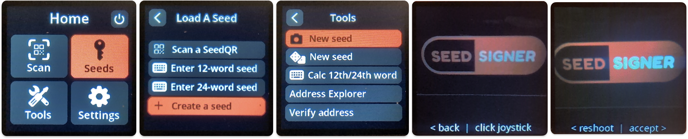

You will then be presented with two screens detailing the 24 word seed that represent the private key you just created. Write these words down and double-check the accuracy of what you copied. You will then be presented with the opportunity to press SeedSigner’s thumb-stick to the right to view the “QR Export” manual transcription interface. This interface allows you to convert your seed phrase to a single-frame QR code that can be used to quickly and easily import your private key into SeedSigner in the future. This “SeedQR” is then viewable in a zoomed-in interface to make the transcription process simpler.

The process to manually create a SeedQR typically takes about 10 minutes, but will save you much more that as you won’t need to enter your seed word-by-word into SeedSigner for subsequent uses. It is worth noting at this point that your QR-encoded seed phrase should **never** be scanned into any device that connects to the internet; SeedSigner should likely be the only device that you ever use to scan your SeedQR, unless perhaps at some point in the future you might use it to enter your seed into another QR-enabled signing device or hardware wallet. Your SeedQR should **never** be scanned into your computer’s webcam, or scanned with your mobile phone’s camera as it represents secret information that could be used to access your funds. It should also be noted that for users leery of encoding your private key into QR-form, your seed words can be manually entered into SeedSigner at any point to set up a new wallet or authorize bitcoin transactions.

Examples of the SeedQR transcription interface:

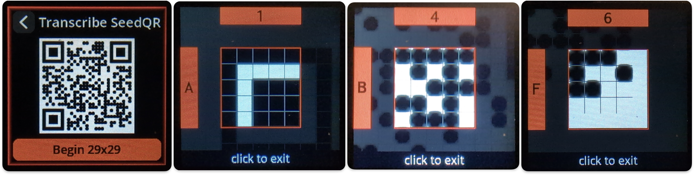

We offer a few user-printable formats for documenting seed phrases and SeedQRs in our repo’s “docs” folder (https://github.com/SeedSigner/seedsigner/tree/main/docs)

Here is an example of a seed phrase and transcribed SeedQR using one of the forms available in the repo:

After you finish the QR transcription process, when asked if you want to “Save Seed?” you can decline this option, and you will be returned to the main menu. From there, go back into “Seed Tools” and select “Temp Seed Storage”. From there select a “Seed Slot” to temporarily store the seed while SeedSigner is powered on. Now scan your handmade SeedQR, and confirm that it scans properly and that the resulting words match what you have written down.

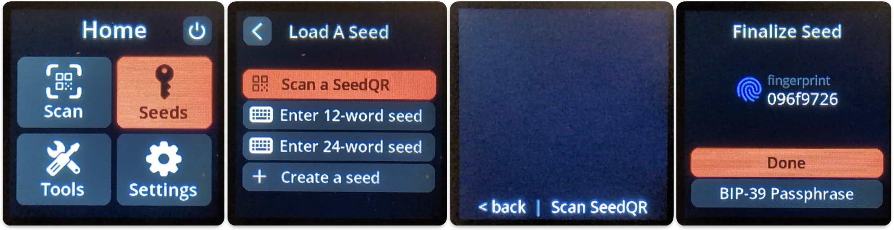

For the 2-of-3 wallet we’ll be setting up for testing, you will need to repeat this process two more times to create a total of three private keys. The good news is that as long as you’re comfortable you’ve maintained the secrecy of these keys during your testing, you can use them for your main-net long-term Bitcoin storage wallet if you like.

Now that you have the necessary three keys created and documented, it’s time to create your testnet wallet in Sparrow. To begin this process, within the Sparrow menu, navigate to File —> New Wallet

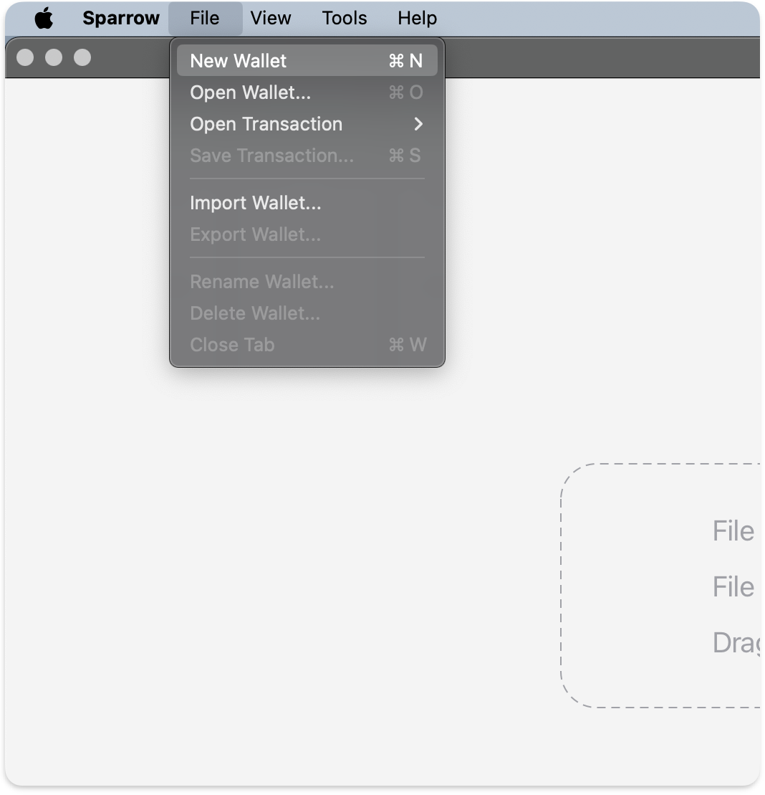

Give the wallet an appropriate name:

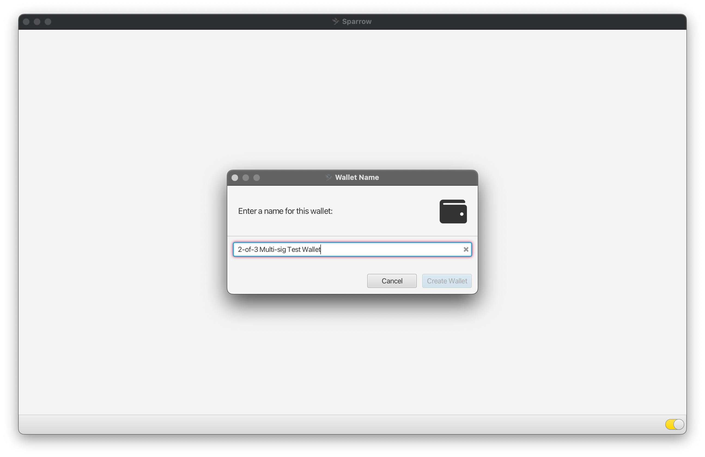

Select “Multi signature” as the wallet Policy Type

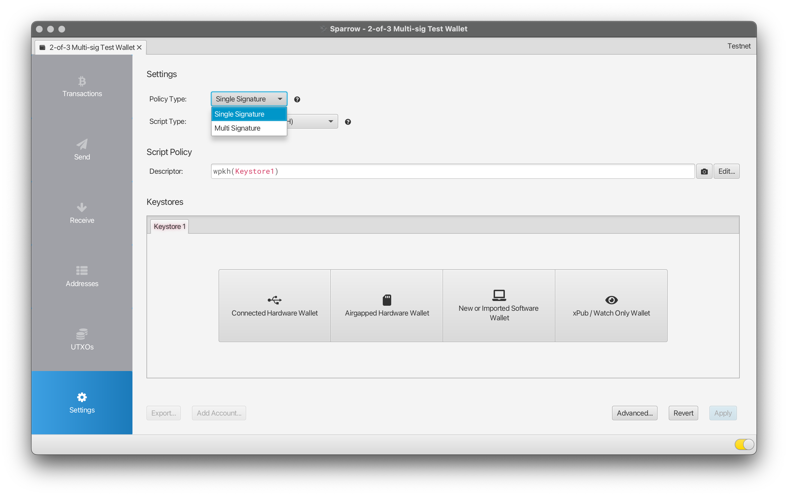

Making this selection will make the configurable option “Cosigners” appear in the upper righthand corner of the window:

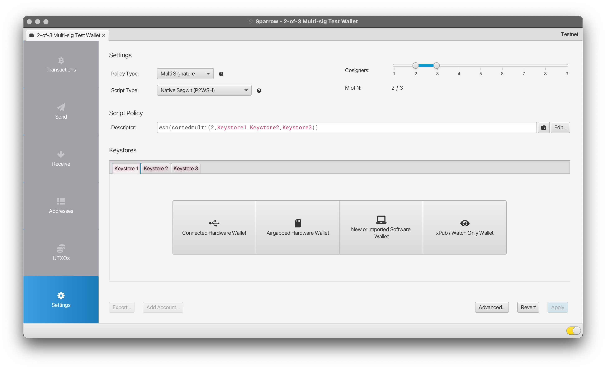

In the above image, you can see that the sliders are positioned such that the created wallet will have a total of three cosigners, and will require a minimum of two of the members to authorize a given transaction.

For the purposes of this guide, we will leave the Script Type as the “Native Segwit (P2WSH)” format.

The next step is to add each of the cosigners, which are referred to as the wallet’s “Keystores” in the Sparrow interface. For this wallet, there are three tabs in the Keystores section, each representing one of the cosigners in the multi-signature wallet quorum. Under the “Keystore 1” tab, you can select the “Airgapped Hardware Wallet” button, which will lead to a list of air-gapped hardware devices:

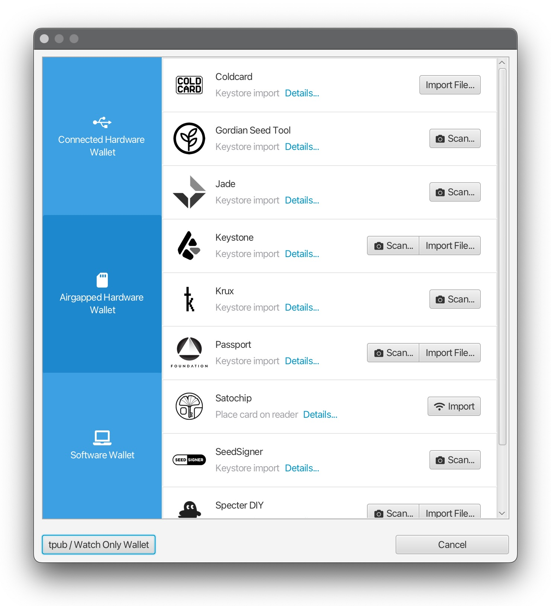

**Important Step:** Return to your SeedSigner, and ensure that "Network" is set to "Testnet" within the SeedSigner settings.

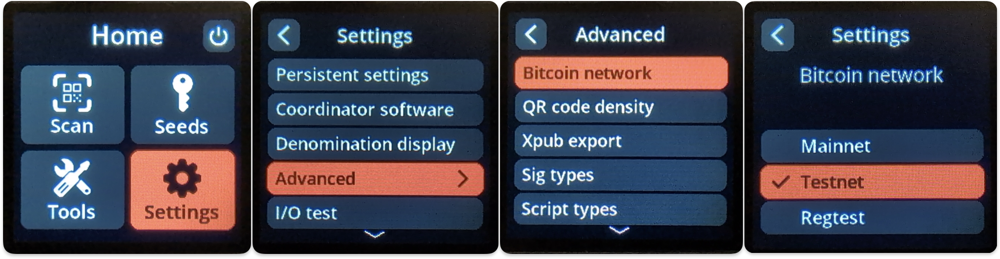

Now follow this menu sequence, which assumes you have temporarily saved the seed(s) you want to use in SeedSigner:

Seed Tools --> xPub from Seed --> Saved Seed? = Y --> Use Seed Slot ## --> (seedword review) -->

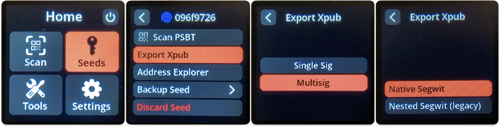

(seedword review) --> Wallet Type = Multisig --> Derivation Path = Native Segwit -->

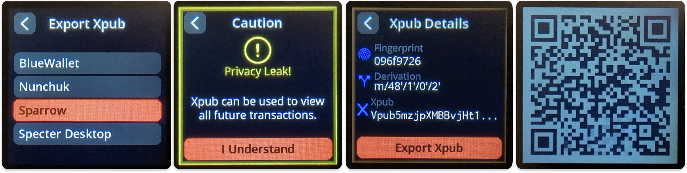

Which Wallet = Sparrow --> (Xpub Info review)

After the Xpub Info Review screen, one or more QR codes will be displayed on the screen that represent your seed's extended public key.

Now return to Sparrow and select the SeedSigner “Scan” button, which should activate your system's web-camera. Now scan the QR code(s) displayed on your SeedSigner into your computer:

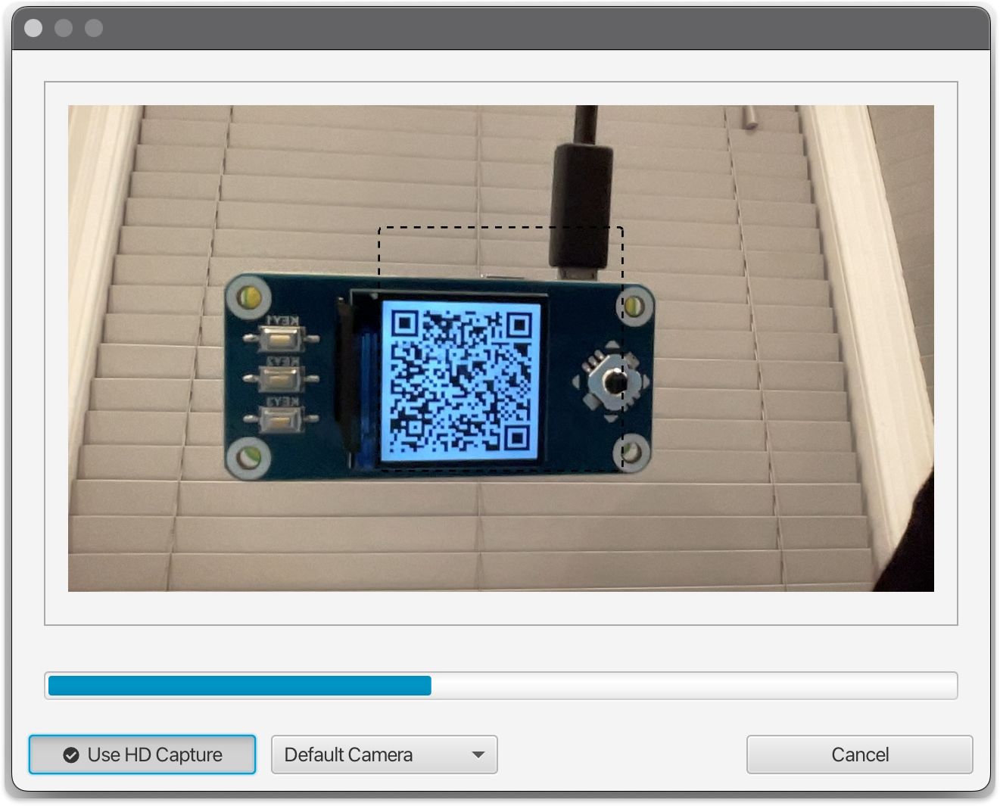

**Important Note:** If the screen from your SeedSigner is causing a glare in the webcam preview window, you can press up or down on the SeedSigner thumbstuck to adjust the brighness of the displayed QR code; ambient lighting can also have an impact on your webcam's ability to focus. It should be noted that some low-budget laptops may not have a sufficiently high-resolution camera to scan SeedSigner's QR codes. Adjusting the "QR Density" setting to "Low" may also resolve webcam scanning difficulties. With some low-quality cameras, advanced techniques can be used to tweak settings and make the camera workable (This is a good resource: https://www.addictivetips.com/windows-tips/access-advanced-settings-for-the-integrated-webcam-on-windows-10/amp/). 

After the QR code(s) representing the extended public key have been scanned into Sparrow, the keystore tab will be renamed "SeedSigner" and information about the public key will be displayed in the Sparrow interface:

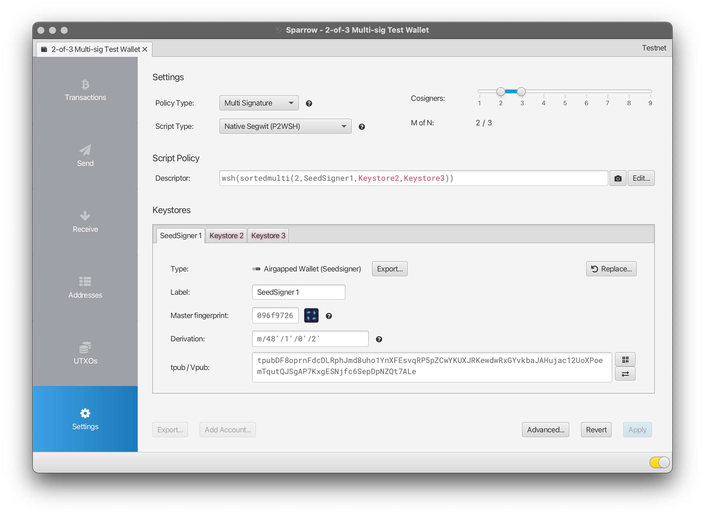

Because this setup is using SeedSigner with three different keys, you can modify the keystore's "Label" to read "SeedSigner 1". After repeating the above process for the second and third keys in your quorum, your wallet configuration window should look similarly to:

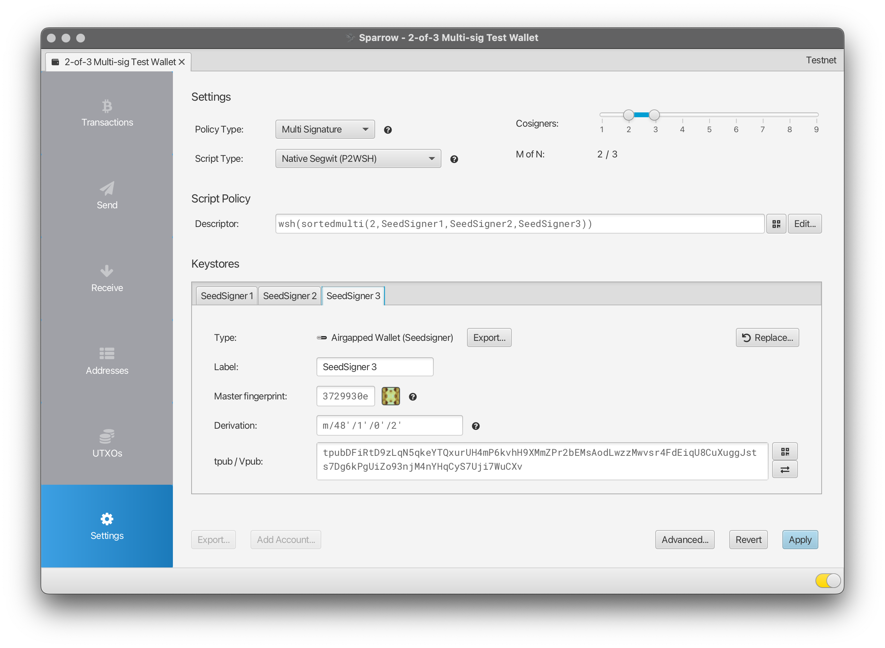

You may now click the "Apply" button in the lower right portion of the window to finalize the settings; Sparrow will display a final prompt asking if you would like to add a password to your wallet:

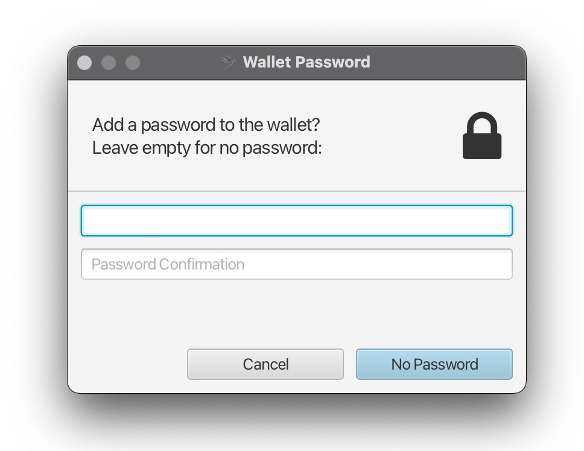

For the purposes of this guide, we will leave these password fields blank and click "No Password".

Not much will appear to change within the Sparrow interface, but your new wallet has been created! The very first thing you want to do with your wallet is to create a static backup of the full wallet descriptor. As previously noted, this descriptor contains a copy of each extended public key, as well as very specific configuration on how the keys are being combined to create the multi-signature wallet. The reasons for preserving this information are two-fold:

* If you ever lose one of your three seeds / private keys, having a copy of the full wallet descriptor is essential to not lose access to your funds. If you lose one of your cosigner private keys and do not have full wallet descriptor, **your funds will be permanently lost**
* If you subsequently want to verify that receive or change addresses belong to your multi-signature wallet as it was originally configured, a historical record of the wallet's configuration information is your **best** resource. As a stateless device, SeedSigner will not retain your wallet configuration information, and should your coordinator software (that's Sparrow in this guide) become somehow compromised, an attacker might try to provide a falsified wallet descriptor as part of an attempt to thwart address verification and steal funds

It should be noted that your full wallet descriptor is designated as private **but not secret** information. This means that the information within the wallet descriptor, if acquired by a third party, could be used to monitor any and all of the transactions made with your wallet. **But** the wallet descriptor **does not** contain the information necessary to access any of your funds. This knowledge may impact how and where you choose to store your wallet descriptor; printed hard copies are of course fully acceptable, but you may also choose to store a copy of your wallet descriptor on your computer, over even in "the cloud" (aka, someone else's computer).

SeedSigner is currently compatible with Specter's wallet descriptor format. To export a wallet descriptor using that format in Sparrow, with your wallet loaded, navigate to File --> Export:

A dialogue box will appear with various wallet descriptor export formats visible, scroll down to the bottom where you will see an entry for "Specter Desktop":

The "Show" option will display a QR code that contains the full wallet descriptor; you can screen-capture this QR code and print or save it as a file for future use:

This QR formatting of the wallet descriptor will be useful when you want to verify a receive or change address using SeedSigner. You can also choose the "Export File" option, and you will have the opportunity to save a .json-formatted file that can also be used to recreate your multi-signature wallet should recovery ever be necessary.

Now that you have created a multi-signature wallet and saved the wallet's descriptor, you're ready to receive some coins! To do so, you just need to visit the "Receive" section of the Sparrow wallet, along the left-hand side of the main window:

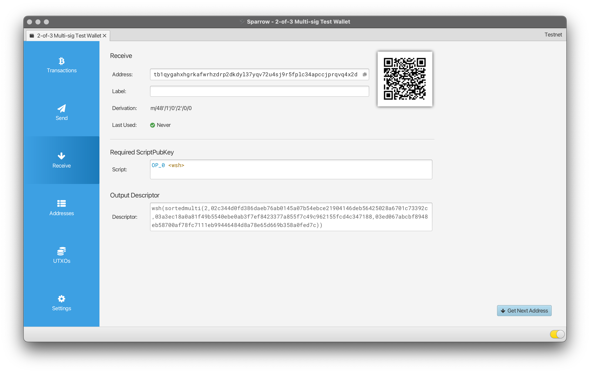

From this section of the Sparrow interface you can access receive addresses as you require them without any need for any of your seed phrases. In this way, Sparrow can be used to accumulate Bitcoin over the long term without needing to have immediate access to any of your private keys.

When you are ready to make a spend, visit the "Send" section of the Sparrow interface. Here you can enter the destination address, a label for the transaction, and of course the amount for the spend:

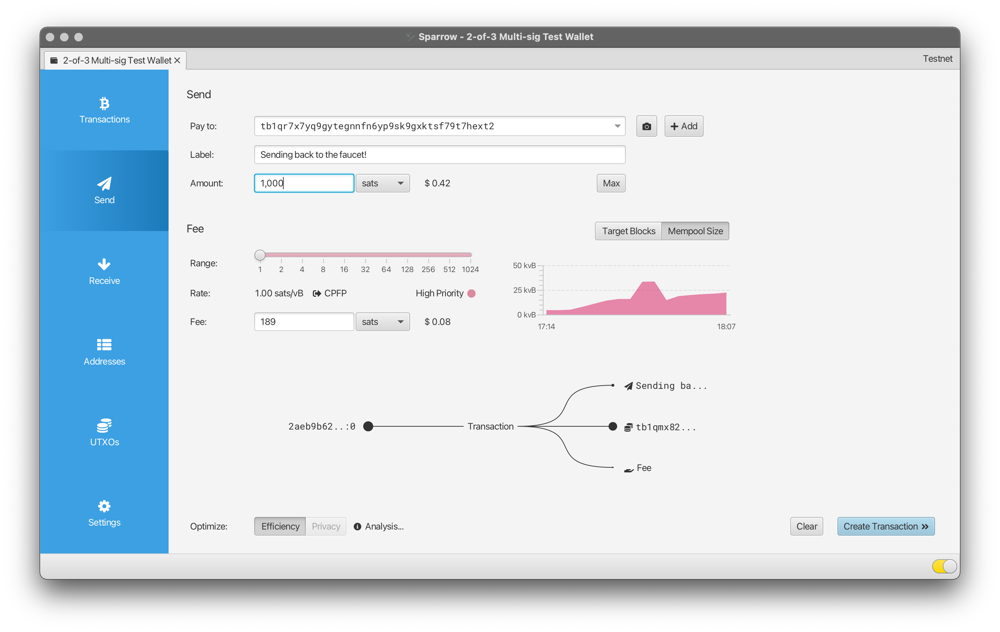

The variables you should be thinking about as you plan your storage setup
- electrum or node?
- 12 or 24 word seeds?
- passphrases?
- metal or no metal?
- How many copies of each key?
- storage locations?
- tamper resistant / evident?
- A quorum of how many?
- Mixing signing devices?

Subsequent note on webcam quality and how it might impact the signing process.

What's the deal with Seed QR codes?

Some notes on metal backups

Acknowledgements: 10x Security Bitcoin Guide

addendum opportunity: using seedsigner as a way to keep your hardware wallets honest
note on the signer vs wallet designation
